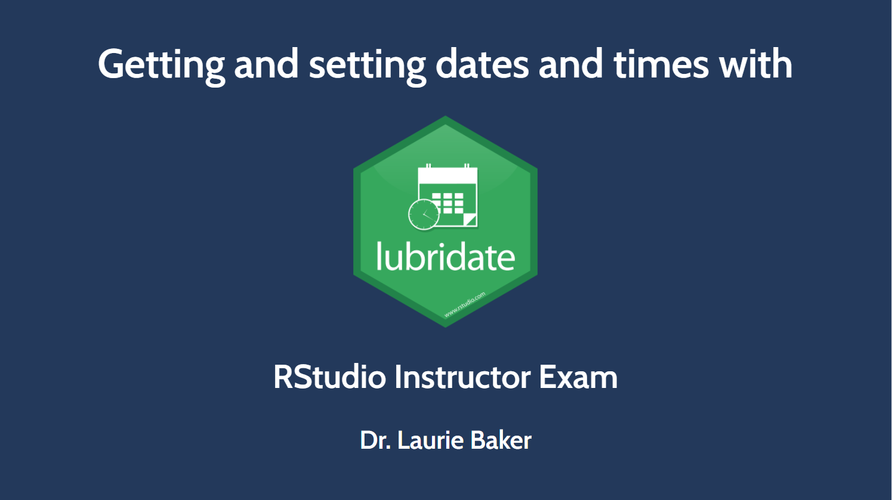
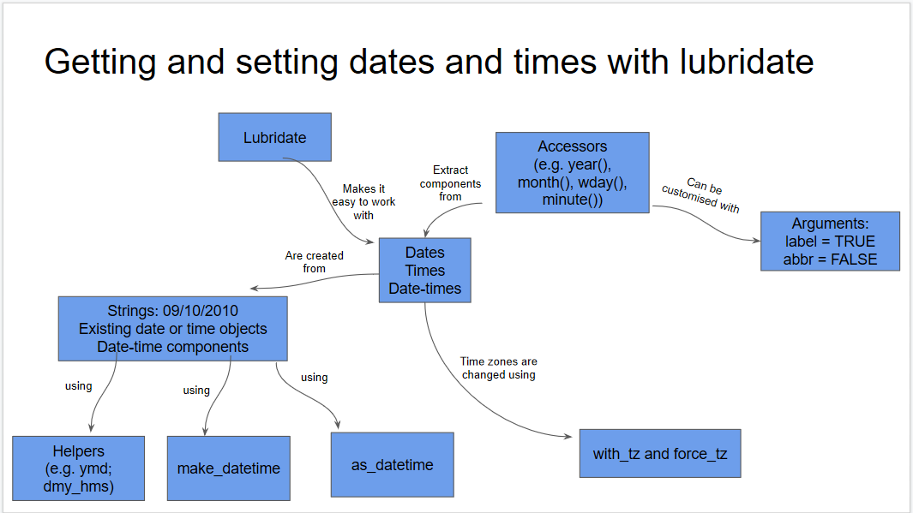

# RStudio Instructor Certification Teaching Exam

For my teaching exam I focused on getting and setting dates and times using the lubridate package. 

# Learner Persona

Sergio leads the reporting of trade statistics on his team and regularly works with time series data. His group produces quarterly reports with summary statistics and line graphs. His country's main trading partners including the Caricom member states and other countries in the Americas. Coordinating meetings with other members states can be challenging at times as they span 5 different time zones. He sometimes gets requests to change his times into Atlantic Standard Time (used by St Lucia) or Eastern Standard Time (used by Jamaica) to be consistent with the majority of member states. 

# Concept Map

# Slides
## [Slides](slides/lubridate_slides.html)

# Exercises

## [Exercises](exercises/lubridate_exercises.Rmd)
